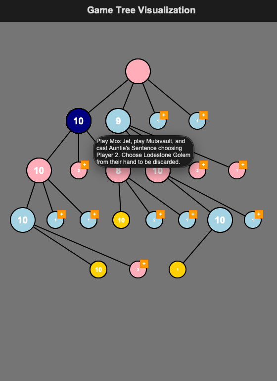
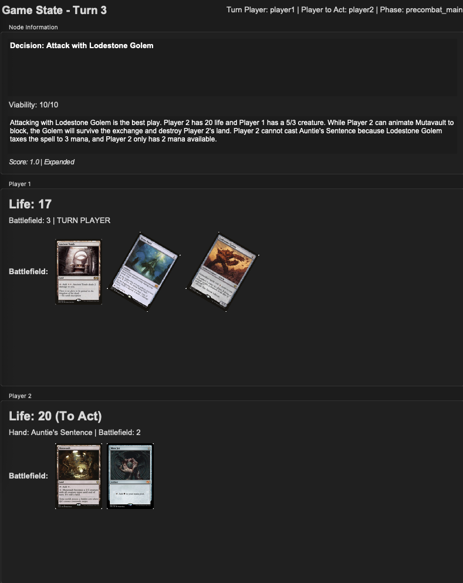

# 3 Card Seer - Magic: The Gathering Matchup Solver

A Python application that solves Magic: The Gathering 3-card blind matchups using AI-driven game tree exploration and min-max optimization. The application uses Google Gemini to generate optimal play decisions and builds comprehensive decision trees for both starting players. These trees can then be visualized and explored in an interactive GUI.

The possible actions and resulting game states are fully handled by Gemini, with no implementation of any game rules or mechanics beyond the training of the AI model. Despite this, the results are still pretty good in my opinion.

The workflow demonstrated here could be applied to any number of situations where modelling the environment, decisions, and outcomes is prohibitively nuanced for a bespoke analysis, but where the enviornment, decisions, and outcomes are already partially encapuslated by a pre-trained AI model.

## Features

- **Card Data Integration**: Automatically fetches card details from Scryfall API
- **AI-Powered Decision Making**: Uses Google Gemini to generate optimal play decisions
- **Game Tree Exploration**: Builds comprehensive decision trees for both starting players
- **Min-Max Optimization**: Applies game theory to determine optimal outcomes
- **Complete Game State Modeling**: Tracks all aspects of MTG gameplay (life, permanents, hand, graveyard, etc.)
- **Interactive Visualization**: GUI with hover effects, tooltips, and visual indicators 
- **Automatic Tree Analysis**: Command-line tools for automated matchup analysis

## Requirements

- Python 3.8+
- Google Gemini API key

## Installation

1. Clone the repository

2. Create a virtual environment:
```bash
python -m venv .venv
source .venv/bin/activate
```

3. Install dependencies:
```bash
pip install -r requirements.txt
```

4. Set up your Gemini API key in the `.env` file:
```
export GEMINI_API_KEY='your_gemini_api_key_here'
```

## Usage

### Automatic Tree Analyzer

```bash
# Basic analysis 
python analyze_matchup.py card1 card2 card3 card4 card5 card6 --matchup_name 'some_name'

# With adjusted analysis settings
python analyze_matchup.py --threshold 7 --max-depth 15 card1 card2 card3 card4 card5 card6 --matchup_name 'some_name' --load-tree --skip-population

# To see all available settings
python analyze_matchup.py --help

# A precomputed test matchup is provided
python analyze_matchup.py 'Mana Vault' 'Ancient Tomb' 'Lodestone Golem' 'Mutavault' 'Mox Jet' 'Aunties Sentence' --matchup_name 'Lodestone_vs_Aunties' --load-tree --skip-population
```

### Tree Visualization
```bash
# Visualize a saved tree
python visualize_tree.py 'tree_name'

# Two test trees are provided
python visualize_tree.py 'Lodestone_vs_Aunties_player1'
python visualize_tree.py 'Lodestone_vs_Aunties_player2'

```

## Visualization

Two displays are provided. First is an interactive tree display. Each decision is visualized as a circular node, with a number corresponding to Gemini's viability score for each option. Hovering over a node shows a tooltip with the description of the decision, and clicking on the node opens the game state display to that point in the tree.



The second display is a game state visualization. This shows the game state of the selected node. Furthermore, it shows Gemini's description of the decision leading to this game state, as well as a viability score for the decision and an explanation for the viability score.



## Architecture

### Core Components

1. **Card Data (`src/card_data.py`)**
   - Scryfall API integration
   - Card data structures and validation

2. **Game State (`src/game_state.py`)**
   - Complete MTG game state modeling
   - Player state, permanents, combat tracking
   - Phase and step management

3. **Game Tree (`src/game_tree.py`)**
   - Decision tree data structures
   - Node management and tree operations
   - Path tracking and analysis

4. **Visual Display (`src/visual_display.py`)**
   - Interactive GUI with tkinter
   - Node visualization of game tree
   - Game state visualization

5. **Gemini Client (`src/gemini_client.py`)**
   - Google Gemini 3.0 API integration
   - Decision generation and parsing
   - Rate limiting and error handling

7. **Matchup Analyzer (`src/matchup_analyzer.py`)**
   - High-level analysis orchestration
   - Tree management and caching
   - Result compilation

## How It Works

1. **Card Fetching**: Retrieves detailed card information from Scryfall API
2. **Tree Initialization**: Creates two game trees (one for each starting player)
3. **Decision Generation**: Uses Gemini AI to explore all legal moves at each game state
4. **Tree Expansion**: Recursively builds the decision tree until terminal states
5. **Optimization**: Applies min-max algorithm with alpha-beta pruning
6. **Analysis**: Determines optimal outcomes and confidence levels
7. **Visualization**: Interactive GUI displays trees and game states


## Limitations

- **AI Response Time**: Gemini API calls can be slow, taking around 10 seconds per decision.
- **AI Accuracy**: Gemini's understanding of complex MTG interactions is poor, and possible decisions are often missed. The game state is also sometimes incorrectly represented.
- **Computational Cost**: The latest models are required for the highest accuracy, and a large number of tokens are required for a full game tree analysis.
- **Computational Complexity**: Full game tree exploration is computationally prohibitive. To this end, the game tree expansion is stopped following a set of rules to reduce the search space.

## How The Game Tree Is Constructed

The game tree is constructed by recursively exploring game states from the initial state. Node expansion ends and a node is scored when either:
- A terminal state is reached where at least one player has life total below 0. The node is scored as a W, L or tie.
- A maximum depth is reached. No node score is assigned.
- A node is assigned a viability less than 6/10 (configurable threshold) by Gemini. No node score is assigned.
- A node has children with viability over 6/10 (configurable threshold). The node is scored as a L for the active player with no good options.
- A node has the same game state as another node in a different branch (a transposition). The node score is copied from the other node.
- A node has has the same game state as a previous node in its own branch (a loop). The node is scored as a tie.
- A node has the same game state as a previous node, except for life totals. In this case, the loop is continued until at least one life total reaches 0, and the node is scored as a W, L or tie.
